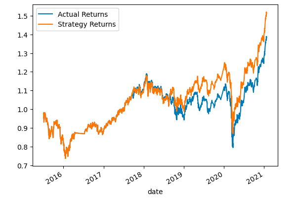
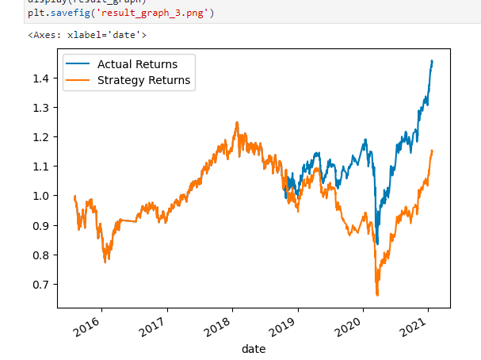

## **Algorithmic Trading Challenge**

**Data used:** Emerging Market Price Data Period Jan 21-2015 to Jan 22, 2021

- **Results**

  **Case 1.** 

Parameter:

- SVC model
- Beginning Date: 2015-04-02 
- Ending Date: 2015-07-02
- Short SMA rolling window = 4
- Long SMA rolling window = 100

Results: 

` `

**Overall accuracy is only 55% not a great outcome** 

**Case 2.**

Conditions:

- SVC model
- Beginning Date: 2015-04-02
- Ending Date: 2015-06-02
- Short SMA rolling window = 10
- Long SMA rolling window = 100

**Results:**

` `

Overall accuracy slightly rose to 56%, but this may not be a comprehensives significant improvement.

